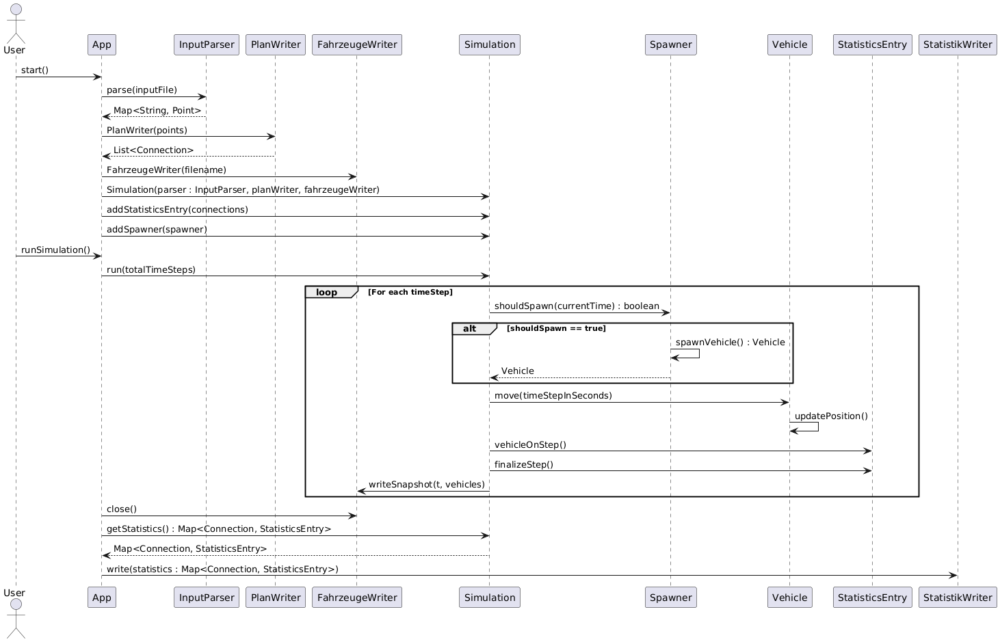
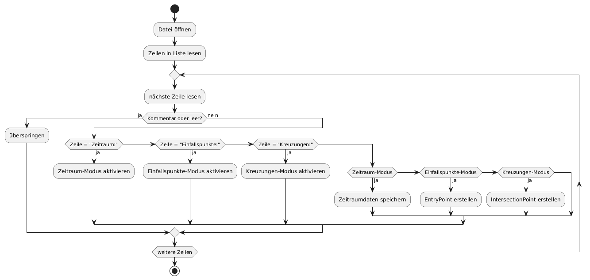
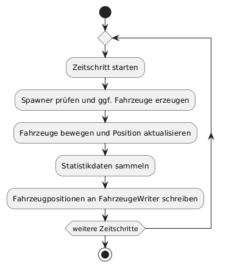
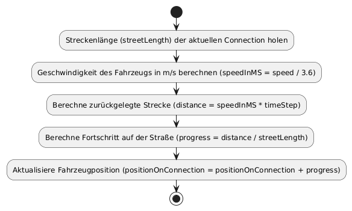
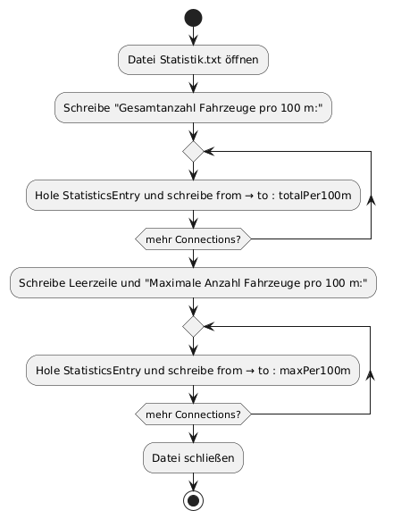
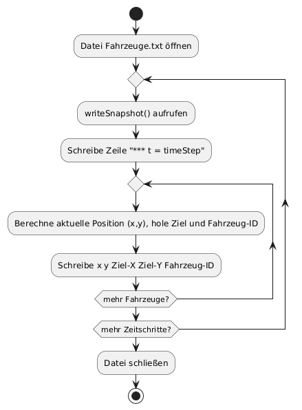

# Inhaltsverzeichnis
1. [Einleitung](#einleitung)
2. [Aufgabenanalyse](#aufgabenanalyse)
3. [Verfahrensbeschreibung](#verfahrensbeschreibung)
    - [Verbale Beschreibung des realisierten Verfahrens am Beispiel](#verbale-beschreibung-des-realisierten-verfahrens-am-beispiel)
4. [Programmbeschreibung](#programmbeschreibung)
    - [UML-Klassendiagramme](#uml-klassendiagramme)
    - [UML-Sequenzdiagramm](#uml-sequenzdiagramm)
    - [Programmablaufplan](#programmablaufplan)
5. [Änderungen gegenüber dem Konzept vom Montag](#änderungen-gegenüber-dem-konzept-vom-montag)
    - [Algorithmische Änderungen](#algorithmische-änderungen)
    - [Optimierungen](#optimierungen)
6. [Erweiterbarkeit gemäß den Anforderungen des Auftraggebers](#erweiterbarkeit-gemäß-den-anforderungen-des-auftraggebers)
    - [Überholverbot und Mindestabstand](#überholverbot-und-mindestabstand)
    - [Verkehrsflussregelung an Kreuzungen (Ampeln, Kreisverkehr, Rechts-vor-Links)](#verkehrsflussregelung-an-kreuzungen-ampeln-kreisverkehr-rechts-vor-links)
    - [Mehrspurige Strecken](#mehrspurige-strecken)
    - [Dynamische Fahrzeuggeschwindigkeiten](#dynamische-fahrzeuggeschwindigkeiten)
    - [Bewertung des Aufwands und Umsetzungsmöglichkeiten](#bewertung-des-aufwands-und-umsetzungsmöglichkeiten)
7. [Benutzeranleitung](#benutzeranleitung)
    - [Installation](#installation)
    - [Ausführung der Beispielsimulationen](#ausführung-der-beispielsimulationen)
    - [Ausführung der Testfälle](#ausführung-der-testfälle)
8. [Entwicklerdokumentation](#entwicklerdokumentation)
    - [Projektstruktur](#projektstruktur)
    - [Funktionale Klassen und Dateien](#funktionale-klassen-und-dateien)
    - [Hilfs- und Zusatzdateien](#hilfs-und-zusatzdateien)
9. [Testbeispiele](#testbeispiele)
    - [Vorgegebene Testfälle](#vorgegebene-testfälle)
    - [Eigene Erweiterungstestfälle](#eigene-erweiterungstestfälle)
10. [Zusammenfassung und Ausblick](#zusammenfassung-und-ausblick)
11. [Quellcode-Auszug](#quellcode-auszug)


<div style="page-break-after: always;"></div>

# Einleitung
Vorliegend ist die Dokumentation meiner Lösung zur Aufgabe "Entwicklung eines Softwaresystems" aus der "Abschlussprüfung Sommer 2025" für den Ausbildungsberuf MATSE, auch "GroPro" genannt.
Ich, Hussein Idris, habe diese Aufgabe eigenhändig, ohne fremde Hilfe und mit großer Sorgfalt gelöst.

Java wurde als Programmiersprache gewählt, da es durch die objektorientierte Struktur, starke Typisierung und die klare Trennung von Verantwortlichkeiten besonders gut für die Modellierung komplexer Systeme geeignet ist.
Darüber hinaus gewährleistet die Plattformunabhängigkeit von Java – dank der Java Virtual Machine (JVM) – eine einfache Portierbarkeit und breite Einsatzfähigkeit der entwickelten Lösung.

Die Reihenfolge der Kapitel folgt nur meiner persönlichen Präferenz.

Ich erkläre verbindlich, dass das vorliegende Prüfprodukt von mir selbstständig erstellt wurde.
Die als Arbeitshilfe gentutzten Unterlagen sind in der Arbeit vollständig aufgeführt.

Ich versichere, dass der vorgelegte Ausdruck mit dem Inhalt der von mir erstellten digitalen Version identisch ist.
Weder ganz noch in Teilen wurde die Arbeit bereits als Prüfungsleistung vorgelegt.
Mir ist bewusst, dass jedes Zuwiderhandeln als Täuschungsversuch zu gelten hat, der die Anerkennung des Prüfprodukts als Prüfungsleistung ausschließt.

Aachen, 16.05.2025

Hussein Idris

_____________
<div style="page-break-after: always;"></div>

# Aufgabenanalyse
Die Firma Matse Ing. hat den Auftrag vergeben, ein Softwareprogramm zu entwickeln, das eine textbasierte Eingabedatei mit Informationen über ein Verkehrsnetz verarbeitet und daraus drei Ausgabedateien im Textformat generiert.
Diese Ausgabedateien sollen detaillierte Informationen über die Verkehrssituation enthalten, beispielsweise die Anzahl der Fahrzeuge auf den einzelnen Strecken.

Das Eingabeformat ist folgendermaßen aufgebaut:
"# Simpelfeld"
Kommentarzeilen beginnen mit # und werden vom Programm ignoriert.

Die Datei startet mit der Definition des Zeitraums. Dieser Abschnitt enthält zwei Werte:
"50 1"
- Die Anzahl der zu simulierenden Zeitschritte
- Die Länge eines Taktes (z.B. in Sekunden)

Im Anschluss folgen zwei weitere wichtige Abschnitte:

Einfallspunkte
"A 1 1 D 10"
Hier werden die Koordinaten der Einfallspunkte angegeben, zusammen mit dem Namen der Zielkreuzung und dem Takt, d.h. in welchem Intervall (Anzahl Zeitschritte) an diesem Punkt Fahrzeuge in das Netz eingespeist werden.

Kreuzungen
"D 1 0 A 1 B 1 C 1"
In diesem Abschnitt werden die Kreuzungen des Netzes definiert. Jede Kreuzung besitzt:

- ihre Koordinaten im Raum

 - eine Liste benachbarter Punkte mit zugehörigen Wahrscheinlichkeiten (in Prozent), die angeben, wie groß der Anteil der Fahrzeuge ist, die jeweils in diese Richtung weiterfahren.

Ziel des Programms ist es, anhand dieser Informationen eine vollständige Simulation der Verkehrslage zu berechnen und die Ergebnisse in standardisierte Textdateien auszugeben.

Für die Simulation gelten folgende Randbedingungen:
Jeder Einfallspunkt ist immer genau mit einer Kreuzung verbunden. Fahrzeuge bewegen sich ausschließlich in eine Richtung entlang des definierten Streckennetzes und können nicht umkehren. Der festgelegte Takt, der bestimmt, in welchen Abständen Fahrzeuge an einem Einfallspunkt erzeugt werden, bleibt über den gesamten Simulationszeitraum konstant und unterliegt keiner zeitlichen Veränderung.

Das Programm erzeugt im Verlauf der Simulation drei Textdateien, die jeweils spezifische Informationen über den Ablauf und das Ergebnis der Simulation enthalten:

1. Plan.txt
Diese Datei enthält eine Übersicht aller Straßenverbindungen (Connections) im Netz. Jede Zeile beschreibt eine Verbindung zwischen zwei Punkten durch Angabe der Start- und Zielkoordinaten in 100-Meter Einheit.

2. Statistik.txt
In dieser Datei werden statistische Auswertungen der Simulation gespeichert. Für jede Verbindung wird sowohl die Gesamtanzahl der Fahrzeuge pro 100 Meter über die gesamte Laufzeit als auch die maximale Anzahl gleichzeitig befindlicher Fahrzeuge pro 100 Meter angegeben.

3. Fahrzeuge.txt
Diese Datei dokumentiert für jeden Zeitschritt die aktuelle Position aller Fahrzeuge. Pro Fahrzeug werden die Koordinaten, das Ziel der aktuellen Verbindung sowie die Fahrzeug-ID ausgegeben. Damit lässt sich der gesamte Bewegungsverlauf der Fahrzeuge im Netz nachvollziehen.

Diese Dateien sind notwendig, um das bereitgestellte Plot-Skript mit den erforderlichen Daten zu versorgen und die Simulation anschließend grafisch darstellen zu können.
<div style="page-break-after: always;"></div>

# Verfahrensbeschreibung

## a) Einlesen und Initialisierung der Daten

Zu Beginn der Programmausführung wird die vom Benutzer angegebene Eingabedatei mit dem `InputParser` eingelesen. Die Datei enthält verschiedene strukturierte Bereiche: Zeitraum, Einfallspunkte und Kreuzungen. Kommentarzeilen und Leerzeilen werden dabei ignoriert. Im Abschnitt "Zeitraum" werden die Anzahl der zu simulierenden Zeitschritte sowie die Dauer eines einzelnen Schrittes in Sekunden eingelesen und gespeichert. Anschließend folgen die "Einfallspunkte", die als `EntryPoint` im Programm genannt wird. Jeder `EntryPoint` beinhaltet neben Namen und Koordinaten auch den Namen der Zielkreuzung sowie das Spawn-Intervall, also in welchem Abstand Fahrzeuge an diesem Punkt erzeugt werden.

Im dritten Abschnitt "Kreuzungen" werden alle `IntersectionPoint`-Objekte angelegt. Auch sie besitzen Namen und Koordinaten, zusätzlich jedoch eine Auflistung benachbarter Punkte mit Wahrscheinlichkeiten, die angeben, wie wahrscheinlich ein Fahrzeug die jeweilige Richtung wählt. Diese Wahrscheinlichkeiten dienen später als Entscheidungsgrundlage beim Routenwechsel der Fahrzeuge.

Im Anschluss wird mit Hilfe der Klasse `PlanWriter` aus den Punkten ein Streckennetz aufgebaut. Dabei werden Verbindungen (sogenannte `Connection`-Objekte) zwischen `IntersectionPoints` <-> `EntryPoints` und `IntersectionPoints` <-> `IntersectionPoints`. Für jeden `EntryPoint` wird eine Verbindung zur ersten Kreuzung erstellt. Jede Verbindung enthält als zusätzliche Information die Distanz, die aus dem euklidischen Abstand zwischen Start- und Zielpunkt berechnet wird.

Parallel dazu werden für jeden `EntryPoint` sogenannte `Spawner` erzeugt. Diese sind dafür verantwortlich, Fahrzeuge während der Simulation gemäß des definierten Spawn-Intervalls und unter zufälliger Normalverteilung der Geschwindigkeit zu erzeugen.

### b) Algorithmus zur Berechnung

Nach erfolgreicher Initialisierung wird das Streckennetz als `Plan.txt` ausgegeben und die Simulation gestartet. Diese läuft innerhalb einer Hauptschleife, die in der `Simulation`-Klasse über die Methode `run()` implementiert ist. Der Simulationszeitraum umfasst alle Zeitschritte von t=0 bis zur in der Eingabedatei festgelegten Zeitraum.

In jedem Zeitschritt wird zunächst überprüft, ob ein `Spawner` ein neues Fahrzeug erzeugen soll. Ist dies der Fall, so wird ein neues `Vehicle`-Objekt erzeugt, das dem zugehörigen Streckenabschnitt zugewiesen wird. Jedes Fahrzeug bewegt sich nun entlang seiner aktuellen Verbindung. Dabei wird die Geschwindigkeit des Fahrzeugs (in km/h) in m/s umgerechnet und entsprechend des Zeitintervalls fortgeschrieben. Hierbei wird berücksichtigt, dass die Fahrzeuge eine konstante Geschwindigkeit innerhalb eines Taktes haben, jedoch unterschiedliche Geschwindigkeiten durch die Normalverteilung erhalten.

Sobald ein Fahrzeug das Ende einer Verbindung erreicht, prüft das Programm, ob das Ziel ein `IntersectionPoint` ist. Falls ja, wird mit Hilfe der hinterlegten Wahrscheinlichkeitsverteilung zufällig entschieden, auf welche der möglichen Anschlussverbindungen das Fahrzeug wechseln soll. Falls nein, bedeutet es dass das Fahrzeug ein `EntryPoint` erreicht hat und somit kann es vom Straßennetz verschwinden. 

Parallel zur Fahrzeugbewegung werden statistische Werte gesammelt. Hierzu wird pro Verbindung ein `StatisticsEntry` geführt. Während des Zeitschritts wird für jedes Fahrzeug, das sich auf einer Verbindung befindet, ein Zähler hochgesetzt. Am Ende des Schrittes wird die Anzahl aufsummiert und geprüft, ob der aktuelle Wert ein neues Maximum darstellt.

Nach Abschluss der Berechnung eines Zeitschritts wird ein Snapshot aller Fahrzeuge in die Datei `Fahrzeuge.txt` geschrieben. Dieser Snapshot enthält die aktuelle Position (berechnet als Zwischenwert zwischen Start- und Endpunkt der Verbindung), das Ziel der Verbindung sowie die Fahrzeug-ID.

Nachdem alle Zeitschritte durchlaufen wurden, wird das Ergebnis in zwei weiteren Dateien zusammengefasst: `Plan.txt` beinhaltet das Streckennetz mit allen Verbindungen, `Statistik.txt` enthält die statistische Auswertung jeder Verbindung, d.h. die Gesamtanzahl und die maximale Anzahl gleichzeitig befindlicher Fahrzeuge pro 100 Meter Strecke.

Das Programm beendet seine Ausführung mit einer Abschlussmeldung und alle Ressourcen wie Dateischreiber werden ordnungsgemäß geschlossen.

<div style="page-break-after: always;"></div>

# Programmbeschreibung
## UML-Klassendiagramme
Das entwickelte Softwaresystem zur Verkehrsnetz-Simulation ist modular und objektorientiert aufgebaut. Die Hauptbestandteile bestehen aus den Bereichen Datenhaltung (Punkte, Verbindungen, Fahrzeuge), Ein-/Ausgabe, Logik (Simulation und Statistik) sowie dem Einstiegspunkt `App`.


**Abbildung 1:** Klassendiagramm

## UML-Sequenzdiagramm
Im dargestellten UML-Sequenzdiagramm wird der Ablauf der Verkehrssimulation abgebildet. Der Benutzer (User) startet das Programm über die `App`, welche anschließend den `InputParser` zum Einlesen der Eingabedatei aufruft. Danach wird das Verkehrsnetz durch den `PlanWriter` erstellt, ein `FahrzeugeWriter` zur Protokollierung der Fahrzeugbewegungen geöffnet und die `Simulation` initialisiert. In der anschließenden Simulationsschleife werden zyklisch Fahrzeuge über den `Spawner` erzeugt, diese bewegen sich entlang ihrer `Connection` über `Vehicle.move()`, und Statistiken (`StatisticsEntry`) sowie Fahrzeugpositionen (`FahrzeugeWriter`) werden fortlaufend aktualisiert. Nach Beendigung der Zeitschritte schließt die `App` den `FahrzeugeWriter`, liest die gesammelten Statistiken aus der `Simulation` und übergibt diese an den `StatistikWriter` zur Ausgabe der Datei `Statistik.txt`.



**Abbildung 2:** Sequenzdiagramm

## Programmablaufplan
Im Folgenden sind Programmablaufpläne (PAP) für wichtigste Methoden des Systems dargestellt.



**Abbildung 3:** Programmablaufplan für Parser



**Abbildung 4:** Programmablaufplan für Simulation



**Abbildung 5:** Programmablaufplan für MoveFahrzeug


**Abbildung 6:** Programmablaufplan für PlanWriter



**Abbildung 7:** Programmablaufplan für StatistikWriter



**Abbildung 8:** Programmablaufplan für FahrzeugeWriter

# Änderungen zum Montag


## Algorithmus


## Optimierung


<div style="page-break-after: always;"></div>

# Benutzeranleitung


## Installation


## Ausführung der Testfälle


## Fehlerfälle


<div style="page-break-after: always;"></div>

# Entwicklerdokumentation
## Projektstruktur
Das Projekt ist wie folgt strukturiert:
```
AP2025s/
├── bin/
│   ├── Kompilierte Klasse
│   └── ...
├── docs/
│   ├── Dokumentation.pdf
│   ├── img/
│   │   ├── Klassendiagramm
│   │   └── ...
│   ├── Plot_howto.txt
│   └── ...
├── input/
│   ├── IHK_01/
│   │   └── Eingabe.txt
│   ├── ...
│   └── Weitere Tests
├── src/
│   ├── app/
│   │   └── App
│   ├── data/
│   │   ├── Connection
│   │   ├── EntryPoint
│   │   ├── IntersectionPoint
│   │   └── Point
│   ├── io/
│   │   ├── FahrZeugeWriter
│   │   ├── InputParser
│   │   ├── PlanWriter
│   │   └── StatistikWriter
│   ├── logic/
│   │   ├── Simulation
│   │   ├── Spawner
│   │   ├── StatisticCalculator
│   │   ├── StatisticEntry
│   │   └── Vehicle
└── Plot.py
```


## Funktionale Dateien

### Code-Dateien


### Datenverarbeitungsdateien


## Nicht-Funktionale Dateien
### Datenhaltungsdateien


### Testdateien


### Sonstiges


# Testbeispiele

## Vorgegebene Testfälle

## Weitere Testfälle

# Zusammenfassung und Ausblick

## Quellcode

