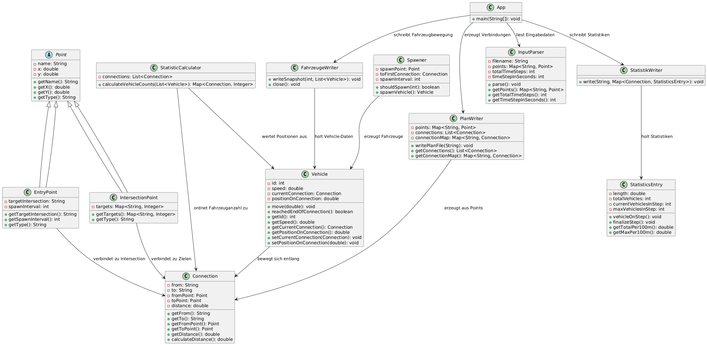
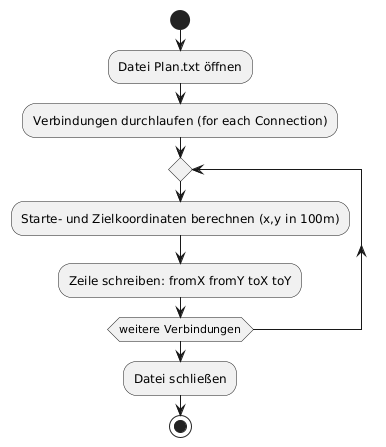

# Inhaltsverzeichnis
1. [Einleitung](#einleitung)
2. [Aufgabenanalyse](#aufgabenanalyse)
3. [Verfahrensbeschreibung](#verfahrensbeschreibung)
    - [Verbale Beschreibung des realisierten Verfahrens](#verbale-beschreibung-des-realisierten-verfahrens)
        - [Algorithmus](#algorithmus)
    - [Formale Beschreibung des realisierten Verfahrens](#formale-beschreibung-des-realisierten-verfahrens)
        - [UML-Klassendiagramme](#uml-klassendiagramme)
        - [UML-Sequenzdiagramm](#uml-sequenzdiagramm)
        - [Programmablaufplan](#programmablaufplan)
4. [Änderungen gegenüber dem Konzept vom Montag](#änderungen-gegenüber-dem-konzept-vom-montag)
    - [Algorithmische Änderungen](#algorithmische-änderungen)
    - [Optimierungen](#optimierungen)
5. [Erweiterbarkeit gemäß den Anforderungen des Auftraggebers](#erweiterbarkeit-gemäß-den-anforderungen-des-auftraggebers)
    - [Mindestabstand und Überholverbot](#mindestabstand-und-überholverbot)
    - [Verkehrsflussregelung an Kreuzungen](#verkehrsflussregelung-an-kreuzungen)
    - [Mehrspurige Strecken](#mehrspurige-strecken)
    - [Dynamische Fahrzeuggeschwindigkeit](#dynamische-fahrzeuggeschwindigkeit)
6. [Benutzeranleitung](#benutzeranleitung)
    - [Installation](#installation)
    - [Ausführung der Testfälle](#ausführung-der-testfälle)
7. [Projektstruktur](#projektstruktur)
8. [Testbeispiele](#testbeispiele)
    - [Vorgegebene Testfälle](#vorgegebene-testfälle)
    - [Eigene Erweiterungstestfälle](#eigene-erweiterungstestfälle)
9. [Zusammenfassung und Ausblick](#zusammenfassung-und-ausblick)

<div style="page-break-after: always;"></div>

# Einleitung
Vorliegend ist die Dokumentation meiner Lösung zur Aufgabe "Entwicklung eines Softwaresystems" aus der "Abschlussprüfung Sommer 2025" für den Ausbildungsberuf MATSE, auch "GroPro" genannt.
Ich, Hussein Idris, habe diese Aufgabe eigenhändig, ohne fremde Hilfe und mit großer Sorgfalt gelöst.

Java wurde als Programmiersprache gewählt, da es durch die objektorientierte Struktur, starke Typisierung und die klare Trennung von Verantwortlichkeiten besonders gut für die Modellierung komplexer Systeme geeignet ist.
Darüber hinaus gewährleistet die Plattformunabhängigkeit von Java – dank der Java Virtual Machine (JVM) – eine einfache Portierbarkeit und breite Einsatzfähigkeit der entwickelten Lösung.

Die Reihenfolge der Kapitel folgt nur meiner persönlichen Präferenz.

Ich erkläre verbindlich, dass das vorliegende Prüfprodukt von mir selbstständig erstellt wurde.
Die als Arbeitshilfe gentutzten Unterlagen sind in der Arbeit vollständig aufgeführt.

Ich versichere, dass der vorgelegte Ausdruck mit dem Inhalt der von mir erstellten digitalen Version identisch ist.
Weder ganz noch in Teilen wurde die Arbeit bereits als Prüfungsleistung vorgelegt.
Mir ist bewusst, dass jedes Zuwiderhandeln als Täuschungsversuch zu gelten hat, der die Anerkennung des Prüfprodukts als Prüfungsleistung ausschließt.

Aachen, 16.05.2025

Hussein Idris

_____________
<div style="page-break-after: always;"></div>

# Aufgabenanalyse
Die Firma Matse Ing. hat den Auftrag vergeben, ein Softwareprogramm zu entwickeln, das eine textbasierte Eingabedatei mit Informationen über ein Verkehrsnetz verarbeitet und daraus drei Ausgabedateien im Textformat generiert.
Diese Ausgabedateien sollen detaillierte Informationen über die Verkehrssituation enthalten, beispielsweise die Anzahl der Fahrzeuge auf den einzelnen Strecken.

Das Eingabeformat ist folgendermaßen aufgebaut:
"# Simpelfeld"
Kommentarzeilen beginnen mit # und werden vom Programm ignoriert.

Die Datei startet mit der Definition des Zeitraums. Dieser Abschnitt enthält zwei Werte:
"50 1"
- Die Anzahl der zu simulierenden Zeitschritte
- Die Länge eines Taktes (z.B. in Sekunden)

Im Anschluss folgen zwei weitere wichtige Abschnitte:

Einfallspunkte
"A 1 1 D 10"
Hier werden die Koordinaten der Einfallspunkte angegeben, zusammen mit dem Namen der Zielkreuzung und dem Takt, d.h. in welchem Intervall (Anzahl Zeitschritte) an diesem Punkt Fahrzeuge in das Netz eingespeist werden.

Kreuzungen
"D 1 0 A 1 B 1 C 1"
In diesem Abschnitt werden die Kreuzungen des Netzes definiert. Jede Kreuzung besitzt:

- ihre Koordinaten im Raum

 - eine Liste benachbarter Punkte mit zugehörigen Wahrscheinlichkeiten (in Prozent), die angeben, wie groß der Anteil der Fahrzeuge ist, die jeweils in diese Richtung weiterfahren.

Ziel des Programms ist es, anhand dieser Informationen eine vollständige Simulation der Verkehrslage zu berechnen und die Ergebnisse in standardisierte Textdateien auszugeben.

Für die Simulation gelten folgende Randbedingungen:
Jeder Einfallspunkt ist immer genau mit einer Kreuzung verbunden. Fahrzeuge bewegen sich ausschließlich in eine Richtung entlang des definierten Streckennetzes und können nicht umkehren. Der festgelegte Takt, der bestimmt, in welchen Abständen Fahrzeuge an einem Einfallspunkt erzeugt werden, bleibt über den gesamten Simulationszeitraum konstant und unterliegt keiner zeitlichen Veränderung.

Das Programm erzeugt im Verlauf der Simulation drei Textdateien, die jeweils spezifische Informationen über den Ablauf und das Ergebnis der Simulation enthalten:

1. Plan.txt
Diese Datei enthält eine Übersicht aller Straßenverbindungen (Connections) im Netz. Jede Zeile beschreibt eine Verbindung zwischen zwei Punkten durch Angabe der Start- und Zielkoordinaten in 100-Meter Einheit.

2. Statistik.txt
In dieser Datei werden statistische Auswertungen der Simulation gespeichert. Für jede Verbindung wird sowohl die Gesamtanzahl der Fahrzeuge pro 100 Meter über die gesamte Laufzeit als auch die maximale Anzahl gleichzeitig befindlicher Fahrzeuge pro 100 Meter angegeben.

3. Fahrzeuge.txt
Diese Datei dokumentiert für jeden Zeitschritt die aktuelle Position aller Fahrzeuge. Pro Fahrzeug werden die Koordinaten, das Ziel der aktuellen Verbindung sowie die Fahrzeug-ID ausgegeben. Damit lässt sich der gesamte Bewegungsverlauf der Fahrzeuge im Netz nachvollziehen.

Diese Dateien sind notwendig, um das bereitgestellte Plot-Skript mit den erforderlichen Daten zu versorgen und die Simulation anschließend grafisch darstellen zu können.
<div style="page-break-after: always;"></div>

# Verfahrensbeschreibung
## Verbale Beschreibung des realisierten Verfahrens
### Algorithmus
**Verkehrsflusssimulation**

Dieses Kapitel beschreibt den zugrunde liegenden Algorithmus der Anwendung zur Simulation des Fahrzeugverkehrs in einem Straßennetz. Die Software verarbeitet eine Eingabedatei mit Straßenknoten (Einfallspunkte und Kreuzungen), berechnet alle Verbindungen, simuliert den Fahrzeugfluss und liefert statistische Auswertungen.

### 1. Initialisierung & Eingabe

**Datei:** `InputParser.java`

Die Anwendung liest eine strukturierte Eingabedatei (`Eingabe.txt`), die drei Hauptsektionen enthält:

- **Zeitraum:** Dauer der Simulation und Zeitintervall (z. B. `100 1` → 100 Zeitschritte à 1 Sekunde).
- **Einfallspunkte:** Fahrzeuge werden dort erzeugt und haben ein Ziel.

- **Kreuzungen:** Definieren Ziele und Gewichtungen der ausgehenden Verbindungen.


Die Informationen werden in Objekte vom Typ `EntryPoint` und `IntersectionPoint` überführt und zentral in einer `Map<String, Point>` gespeichert.


### 2. Aufbau des Straßennetzes

**Datei:** `PlanWriter.java`

Aus den Punkten (Einfallspunkte und Kreuzungen) werden alle möglichen Verbindungen (`Connection`) generiert. Die Distanz zwischen zwei Punkten wird berechnet mit:

```java
double distance = sqrt((x2 - x1)^2 + (y2 - y1)^2);
````

Die Verbindungen werden in einer Liste und einem Lookup-Map gespeichert. Zusätzlich wird die Datei `Plan.txt` erzeugt, welche alle Verbindungen für mögliche grafische Visualisierung enthält.


### 3. Vorbereitung der Simulation

**Datei:** `App.java`

#### Konfiguriert:

* Die Simulation mit einem `Simulation`-Objekt
* Statistische Verfolgung pro Verbindung mit `StatisticsEntry`
* `Spawner`-Objekte für jeden Einfallspunkt, die Fahrzeuge nach festem Zeitintervall erzeugen
* Datei-Ausgaben:

  * `Fahrzeuge.txt`: Positionen aller Fahrzeuge pro Zeitschritt
  * `Statistik.txt`: Statistische Auswertung der Verbindungen

### 4. Simulationslauf

Die Simulation wird über `T` Zeitschritte ausgeführt. In jedem Schritt passieren folgende Aktionen:

1. **Fahrzeuge erzeugen**

   * Jeder `Spawner` prüft per `shouldSpawn(t)`, ob ein neues Fahrzeug erzeugt werden soll.
   * Neue Fahrzeuge erhalten eine normalverteilte Geschwindigkeit (z. B. Mittelwert 45 km/h).

2. **Fahrzeuge bewegen**

   * Bewegung entlang aktueller Verbindung mit `Vehicle.move()`.
   * Fortschritt basiert auf Zeitintervall und Geschwindigkeit.

3. **Verbindungswechsel**

   * Wird das Ende einer Verbindung erreicht (`reachedEndOfConnection()`), erfolgt eine Weiterleitung auf die nächste Verbindung (in der Klasse `Simulation` implementiert).

4. **Statistik aktualisieren**

   * Jedes Fahrzeug wird für die aktuelle Verbindung gezählt.
   * Am Ende jedes Zeitschritts wird `finalizeStep()` aufgerufen, um Statistiken zu speichern.

5. **Snapshot-Export**

   * Alle Fahrzeugpositionen werden mit Zeitstempel in `Fahrzeuge.txt` geschrieben.


## 5. Abschluss und Auswertung

Nach Ende der Simulation:

* Die Datei `Fahrzeuge.txt` wird geschlossen.
* Die Datei `Statistik.txt` wird erzeugt mit:

  * **Gesamtanzahl Fahrzeuge pro 100 m**
  * **Maximale Anzahl Fahrzeuge pro 100 m**

Beispielauszug für Statistik.txt:

```
Gesamtanzahl Fahrzeuge pro 100 m:
A -> B: 25.3
B -> B: 18.7
...

Maximale Anzahl Fahrzeuge pro 100 m:
A -> B: 5.2
B -> A: 3.8
...
```
Beispielauszug für Fahrzeuge.txt:

```
*** t = 0
*** t = 1
4.0 2.0 1.0 0
0.0 0.0 0.0 1
...

```

<div style="page-break-after: always;"></div>

## Verbale Beschreibung des realisierten Verfahrens
### UML-Klassendiagramme
Das entwickelte Softwaresystem zur Verkehrsnetz-Simulation ist modular und objektorientiert aufgebaut. Die Hauptbestandteile bestehen aus den Bereichen Datenhaltung (Punkte, Verbindungen, Fahrzeuge), Ein-/Ausgabe, Logik (Simulation und Statistik) sowie dem Einstiegspunkt `App`.



**Abbildung 1:** Klassendiagramm

### UML-Sequenzdiagramm
Im dargestellten UML-Sequenzdiagramm wird der Ablauf der Verkehrssimulation abgebildet. Der Benutzer (User) startet das Programm über die `App`, welche anschließend den `InputParser` zum Einlesen der Eingabedatei aufruft. Danach wird das Verkehrsnetz durch den `PlanWriter` erstellt, ein `FahrzeugeWriter` zur Protokollierung der Fahrzeugbewegungen geöffnet und die `Simulation` initialisiert. In der anschließenden Simulationsschleife werden zyklisch Fahrzeuge über den `Spawner` erzeugt, diese bewegen sich entlang ihrer `Connection` über `Vehicle.move()`, und Statistiken (`StatisticsEntry`) sowie Fahrzeugpositionen (`FahrzeugeWriter`) werden fortlaufend aktualisiert. Nach Beendigung der Zeitschritte schließt die `App` den `FahrzeugeWriter`, liest die gesammelten Statistiken aus der `Simulation` und übergibt diese an den `StatistikWriter` zur Ausgabe der Datei `Statistik.txt`.


**Abbildung 2:** Sequenzdiagramm

### Programmablaufplan
Im Folgenden sind Programmablaufpläne (PAP) für wichtigste Methoden des Systems dargestellt.


**Abbildung 3:** Programmablaufplan für Parser


**Abbildung 4:** Programmablaufplan für Simulation


**Abbildung 5:** Programmablaufplan für MoveFahrzeug



**Abbildung 6:** Programmablaufplan für PlanWriter


**Abbildung 7:** Programmablaufplan für StatistikWriter


**Abbildung 8:** Programmablaufplan für FahrzeugeWriter

# Änderungen gegenüber dem Konzept vom Montag
## Algorithmische Änderungen
In meinem ersten Konzept am Montag war das Ziel, ein vollständiges Streckennetz, Fahrzeuge-Daten und Statistiken mithilfe der Eingabedatei zu erzeugen.

**Streckenetz:** Hierzu sollte ab jeder Kreuzung ein Algorithmus gestartet werden, der alle erreichbaren Punkte jeweils einmal in beide Richtungen durchläuft. Dabei musste jede besuchte Strecke gespeichert werden, um eine erneute Berechnung und damit doppelte Erfassung zu vermeiden. Diese Vorgehensweise wurde auch in der finalen Programmversion erfolgreich umgesetzt.

**buildConnectionsFromIntersections()**: erzeugt alle Strecken zwischen Kreuzungen gemäß der Wahrscheinlichkeiten.

**buildConnectionsFromEntryPoints()**: erzeugt Verbindungen zwischen Einfallspunkten und deren Zielkreuzungen.

Eine doppelte Erzeugung wird durch die Nutzung einer HashSet-Struktur (connectionsSet) verhindert.

Somit ist der Grundalgorithmus gleich geblieben, wurde aber in der Implementierung vereinfacht und robuster gestaltet.


## Optimierungen

**Statistik:** Der ursprüngliche Ansatz zur Berechnung der Fahrzeuganzahl pro Strecke basierte auf einer theoretischen Formel:

$$
x = \frac{t}{T(EP_i)} \quad \text{(Anzahl Fahrzeuge am Einfallspunkt i)}
$$

$$
\text{Gesamtanzahl} = \sum_{i=1}^n \frac{t}{T(EP_i)}
$$

und zur Normalisierung:

$$
\text{Normierte Anzahl} = \frac{\sum X}{\text{Streckenlänge}}
$$

Dieser Ansatz wurde im finalen Programm durch eine realitätsnahe Zählung ersetzt:

* Jedes Fahrzeug wird real erzeugt, bewegt und gezählt.
* Die Klasse **StatisticsEntry** zählt pro Verbindung:

  * Anzahl Fahrzeuge pro Zeitschritt
  * Summierte Gesamtanzahl aller Fahrzeuge
  * Maximal gleichzeitig anwesende Fahrzeuge

Somit liefert die finale Simulation präzisere, dynamische Werte.

**Fahrzeuge:** Auch die Berechnung der Fahrzeugpositionen wurde deutlich verbessert:

* Montag: geplante Berechnung als $X_{neu} = X_{Start} + \Delta X$ war schwierig umzusetzen.
* Jetzt: exakte lineare Interpolation zwischen Start- und Zielpunkt basierend auf **positionOnConnection** (Wert zwischen 0 und 1).
* Implementiert in **FahrzeugeWriter.writeSnapshot()**.

## Zusammenfassung

Die Grundidee meines Montag-Konzepts wurde teilweise beibehalten. Die finale Implementierung nutzt jedoch elegantere und sicherere Methoden sowie echte Simulation. Nachdem ich tiefer an der Aufgabe und Simulation nachgedacht habe, kam ich auf bessere, leichtere und realistischer Ideen.


<div style="page-break-after: always;"></div>

# Erweiterbarkeit gemäß den Anforderungen des Auftraggebers
Die vorliegende Software wurde so konzipiert, dass sie neben der Erfüllung der Grundanforderungen des Auftraggebers insbesondere eine solide Basis für zukünftige Erweiterungen bietet. Ziel war es, eine flexible Architektur zu schaffen, die auf neue Anforderungen – wie zum Beispiel:
- Mindestabstand und Überholverbot
- Kreuzungen mit Verkehrsregeln - wie Ampeln, Kreisverkehr oder Rechts-Vor-Links
- Mehrspurige Strecken
- Dynamische Fahrzeuggeschwindigkeit


In diesem Kapitel werden die vier Erweiterungsmöglichkeiten vorgestellt, die aus Sicht des Auftraggebers besonders relevant sind. Zu jeder Erweiterung werden das Problem und ein möglicher Lösungsansatz erläutert.

## Mindestabstand und Überholverbot
**Problem:** In der aktuellen Implementierung bewegen sich Fahrzeuge unabhängig voneinander und können sich auf derselben Position befinden – d. h., sie „durchfahren“ einander. Dies vereinfacht die Simulation, entspricht jedoch nicht dem realen Verkehrsverhalten. Eine realistischere Simulation erfordert, dass Fahrzeuge einen Mindestabstand einhalten und nicht überholen dürfen.

**Lösungsansatz:** Die Umsetzung von Mindestabstand und Überholverbot erfolgt durch eine Erweiterung der Methode `Vehicle.move()`. Vor der Positionsaktualisierung prüft das Fahrzeug, ob ein vorausfahrendes Fahrzeug auf derselben Verbindung vorhanden ist und ob der Abstand größer als ein definierter Mindestabstand (z. B. 5 m) ist. Falls nicht, unterbleibt die Bewegung. Die Verwaltung erfolgt über eine sortierte Liste von Fahrzeugen pro `Connection`, wodurch die Reihenfolge und Abstandsprüfung effizient möglich ist. Die Architektur erlaubt dies, da `Simulation` bereits pro Zeitschritt alle Fahrzeuge verarbeitet und `Vehicle` die eigene Position kontinuierlich über `positionOnConnection` pflegt.

## Verkehrsflussregelung an Kreuzungen
**Problem:** In der aktuellen Simulation fahren Fahrzeuge ohne Unterbrechung durch Kreuzungen. Für eine realitätsnahe Simulation müssen jedoch Verkehrsregeln wie Ampelsteuerungen oder Vorrangregeln berücksichtigt werden. Fahrzeuge sollen ggf. an Kreuzungen anhalten oder warten.

**Lösungsansatz:** Zur Umsetzung von Ampeln oder Vorfahrtsregeln kann jedem `IntersectionPoint` optional ein `IntersectionController` zugewiesen werden. Vor dem Wechsel auf die nächste Verbindung ruft das Fahrzeug eine neue Methode wie `canProceed()` auf, die prüft, ob das Überqueren aktuell erlaubt ist (z. B. grüne Ampel oder Vorrang gegeben). Die Entscheidung wird in einer neuen Methode in der Klasse `Simulation` getroffen. Die Architektur unterstützt dies, da `IntersectionPoint` erweiterbar ist und somit auch die Logik modular ergänzt werden kann.

## Mehrspurige Strecken
**Problem:** Aktuell existieren Verbindungen (`Connection`) nur mit einer einzigen Fahrspur pro Richtung. In einem realistischeren Modell sind Straßen häufig mehrspurig, was ein paralleles Fahren und Überholen ermöglichen würde.

**Lösungsansatz:** Für mehrspurige Straßen kann jede `Connection` mehrere Fahrspuren bekommen, zum Beispiel als Liste von Fahrzeuglisten (`List<Vehicle>[]`). Beim Erzeugen eines Fahrzeugs in `Spawner.spawnVehicle()` wird zufällig oder gezielt eine Spur ausgewählt. Die Bewegung auf der Spur bleibt wie bisher über `Vehicle.move()` geregelt. Spurwechsel lassen sich später durch eine eigene Strategie ergänzen. Da Verbindungen (Straßen) hier schon als eigene Objekte funktionieren, kann man das einfach erweitern, ohne den Rest des Programms ändern zu müssen.

## Dynamische Fahrzeuggeschwindigkeit
**Problem:** Bisher fahren Fahrzeuge mit einer konstanten, zufällig festgelegten Geschwindigkeit. In der Realität ändern Fahrzeuge ihre Geschwindigkeit abhängig von Verkehr, Straßenbedingungen, Kurven oder Tempolimits.

**Lösungsansatz:** Um streckenabhängige Geschwindigkeiten zu simulieren, wird `Connection` um ein Attribut `speedLimit` ergänzt. Beim Wechsel auf eine neue Verbindung prüft das Fahrzeug in `setCurrentConnection()` die erlaubte Höchstgeschwindigkeit und passt die eigene `speed` ggf. an. Alternativ kann pro Zeitschritt in `Vehicle.move()` die Geschwindigkeit dynamisch angepasst werden (z. B. bei Kurven, Stau). Die vorhandene Architektur erlaubt diese Erweiterung problemlos, da die Bewegung bereits zentral über `Vehicle.move()` gesteuert wird.


# Benutzeranleitung
Diese Anleitung beschreibt, wie Sie das Verkehrsflusssimulationsprogramm installieren, konfigurieren und ausführen können.

## Voraussetzungen
- Java Developer Kit (JDK) Version 17 oder höher
- Betriebssystem: Windows oder Linux
- Terminal oder Konsole

## Installation
1. Projektcode aus dem Repository oder als ZIP herunterladen
2. In ein beliebiges Verzeichnis entpacken
3. In das Projektverzeichnis wechseln

## Ausführung der Testfälle
### Kompilieren und Starten
**Linux:**
```
javac -d bin src/**/*.java
java -cp bin app.App <Pfad_zur_Eingabe.txt> <Ausgabeordner>
```
**Windows (CMD):**
```javac -d bin src\**\*.java
java -cp bin app.App <Pfad_zur_Eingabe.txt> <Ausgabeordner>
```
Beispiel für `<Pfad_zur_Eingabe.txt>`:

- Linux:

    `./input/Eingabe_IHK_03.txt`

- Windows (CMD):

    `.\input\Eingabe_IHK_03.txt`

Beispiel für `<Ausgabeordner>`:
    `output_03`

Wenn Sie die Argumente <Pfad_zur_Eingabe.txt> oder <Ausgabeordner> falsch eingeben, kann das Programm nicht funktionieren.
Ausgabeordner wird automatsch erzeugt wenn das Programm richtig kompiliert und gestartet ist.

### Grafik Simulation
Der Aufruf von "Plot.py" erfordert genau einen Parameter: den absoluten Pfad des Verzeichnisses, in dem alle Dateien des Testfalls liegen. Jeder Testfall sollte in einem eigenen Verzeichnis liegen. Darin liegt ein Unterverzeichnis "plots", in dem die PNG-Plots gespeichert werden. Existiert "plots" nicht, wird es angelegt. 

Die Visualisierung zeigt alle Zeitschritte mit Überschrift an. Am Ende die Simulation beginnt sie automatisch von vorne. Der erste Durchgang ist langsamer, weil die PNG-Bilder erzeugt werden.
```
python3 Plot.py output_03/
```

## Projektstruktur
Das Projekt ist wie folgt strukturiert:
```
AP2025s/
├── bin/
│   ├── Kompilierte Klasse
│   └── ...
├── docs/
│   ├── Dokumentation.pdf
│   ├── img/
│   │   ├── Klassendiagramm
│   │   └── ...
│   ├── Plot_howto.txt
│   └── ...
├── referenz_output/
│   ├── output_IHK_01
│   │   ├── plots
│   │   │   ├── t=0
│   │   │   └── ...
│   │   ├── Plan.txt
│   │   └── ...
│   └── ...
├── input/
│   ├── Eingabe_IHK_01.txt
│   └── ...
├── src/
│   ├── app/
│   │   └── App
│   ├── data/
│   │   ├── Connection
│   │   ├── EntryPoint
│   │   ├── IntersectionPoint
│   │   └── Point
│   ├── io/
│   │   ├── FahrZeugeWriter
│   │   ├── InputParser
│   │   ├── PlanWriter
│   │   └── StatistikWriter
│   ├── logic/
│   │   ├── Simulation
│   │   ├── Spawner
│   │   ├── StatisticCalculator
│   │   ├── StatisticEntry
│   │   └── Vehicle
└── Plot.py
```

# Test

## Vorgegebene Testfälle

Die vorgegebenen Testfälle befinden sich in den Ordnern `input/IHK_*`. Ich habe alle fünf Testfälle erfolgreich mit dem entwickelten Programm ausgeführt. Die generierten Ergebnisse sind nachvollziehbar und sinnvoll.

Die Datei `Plan.txt`, deren Inhalte deterministisch sind, konnte direkt mit den im Aufgabenblatt gezeigten Werten verglichen werden – sie stimmen überein. Die Dateien `Statistik.txt` und `Fahrzeuge.txt` enthalten Zufallseinflüsse. Daher sind exakte Übereinstimmungen mit Beispielwerten nicht möglich. Dennoch zeigen die Ausgaben eine konsistente Logik und realistische Verkehrsdynamik, was die korrekte Funktionsweise der Simulation bestätigt.

Die im Verzeichnis `referenz_output/` enthaltenen Dateien zeigen beispielhafte Ausgaben der Simulation und dienen zur Veranschaulichung der Programmfunktion. Sie werden bei jedem Programmlauf neu erzeugt und können sich durch Zufallseinflüsse leicht unterscheiden.

## Weitere Testfälle

# Zusammenfassung und Ausblick
In diesem Projekt wurde eine verkehrsbasierte Simulationsumgebung entwickelt, die den Fluss von Fahrzeugen durch ein Netzwerk aus Einfallspunkten und Kreuzungen modelliert. Die Anwendung liest eine strukturierte Eingabedatei, konstruiert automatisch ein Straßennetz, simuliert den Fahrzeugfluss über definierte Zeitintervalle und dokumentiert sowohl Momentaufnahmen der Fahrzeugpositionen als auch statistische Auswertungen der Netzlast.

Die Software ist modular aufgebaut und trennt sauber die Verarbeitungsschritte: Eingabeparsing, Netzaufbau, Simulation, Statistik und Ausgabe.

Die bestehende Architektur ermöglicht eine einfache Erweiterung des Systems. In einem nächsten Schritt könnten die in Kapitel Erweiterbarkeit beschriebenen Funktionserweiterungen – wie Mindestabstand, Ampelregelungen, mehrspurige Straßen oder dynamische Geschwindigkeiten – umgesetzt werden. Darüber hinaus wäre es denkbar, weitere Features zu integrieren. Damit bietet die Anwendung eine solide Grundlage für vielfältige Weiterentwicklungen im Bereich verkehrsbasierter Simulationen.

